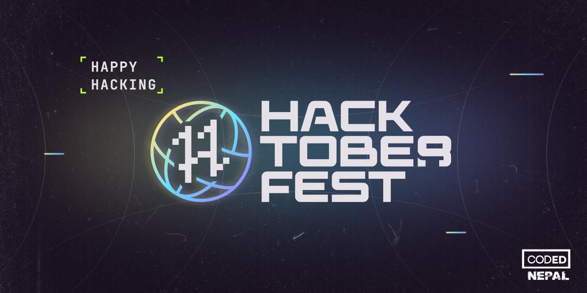

<h2 align=center> HacktoberFest 2022 :fire:</h2>

    

>-The power of open source is power of people,the people rule.(Philippe)
#### [hacktoberfest 2022](https://hacktoberfest.com/)

### Let's Contribute :+1:
- **Step 1** - Fork this repository.
- **Step 2** - Clone the repository to your local machine.
- **Step 3** - Resolve the bugs, mentions provided in the Issues section of the repository. *Also add a description of what changes you have done*.
- **Step 4** - Add the changes to your repository.
- **Step 5** - Create a PULL Request. And that's all.
- **NOTE** - Please start the filename with the platform name on which the problem was solved. 
### What you can contribute in this repo? :punch:
- You can add your own competitive programming solutions or coding related solution. 
- There are various topics like Recursion , Bits Manipulation, Graphs etc. ***You can contribute in them***
- You can contribute some **Learning Resources** in the ***Readme.md*** File.
- You can modify previous solutions if you feel like your solution has better ***Time or Space complexity.***

##### Let's Contribute :smiley:
