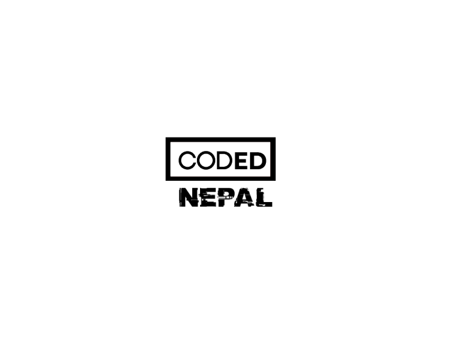

     

 <h1 align="center" style="border: 0;">  Hacktober Fest 2022 </h1>

<h2 align=center> Give a Star to This repo:fire::star:</h2>

      &nbsp;&nbsp;&nbsp;
  
    &nbsp;&nbsp;&nbsp;
  
   
  

<b>Open source for everybody.</b>

## Table of Contents

- [C-Programming](/C-codes)
- [C++-Programming](/c++)
- [Java-Programming](/Java-codes)
- [React](/React)
- [Python Programming](/python)
- [Web-Projects](/Web)

## Contributing

Contributions are always welcome!

See `contributing.md` for ways to get started.

  Add any Simple or Complex Program in any language you Like in this Repository by clicking "Add File -> Create new File".

If you liked working on this project, please share this project as much as you can and star this project to help as many people in opensource as you can.

## Note:

1. Don't Create Pull Request to update "readme.md" File.
2. Upload or Create File in Specified Language Folder.
3. If Specified Language Folder not Found then Create Folder and then Upload or Create File.
